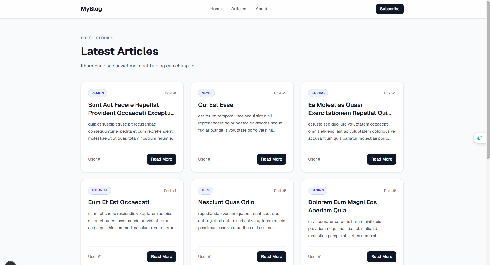
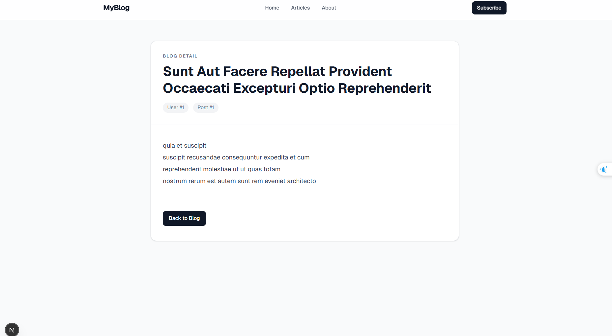
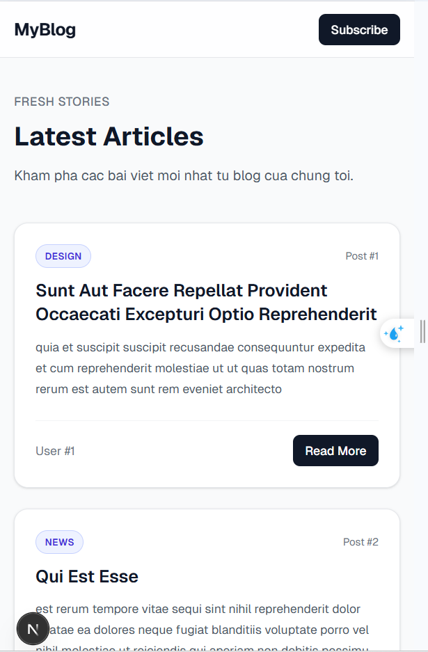

# Blog Listing Page - NextJS & Tailwind

## Demo giao diện

### Trang danh sách bài viết


### Trang chi tiết bài viết


### Trang danh sách bài viết mobile

## Giới thiệu
Đây là bài thực hành xây dựng trang Blog Listing Page bằng NextJS App Router và Tailwind CSS.  
Dự án lấy dữ liệu bài viết từ JSONPlaceholder API và hiển thị theo dạng danh sách responsive.

## Mục tiêu
- Làm quen với quy trình Git và GitHub
- Khởi tạo dự án bằng NextJS
- Xây dựng giao diện responsive với Tailwind CSS
- Fetch dữ liệu từ REST API và hiển thị lên giao diện
- Xây dựng trang chi tiết bài viết bằng dynamic route

## Công nghệ sử dụng
- NextJS
- React
- Tailwind CSS
- JSONPlaceholder API
- Git & GitHub

## Tính năng chính
- Hiển thị danh sách bài viết theo dạng grid
- Giao diện responsive trên mobile, tablet, desktop
- Header điều hướng cơ bản
- Blog card có tiêu đề, nội dung tóm tắt, user và nút Read More
- Trang chi tiết bài viết tại `/blog/[id]`
- Nút quay lại trang danh sách bài viết

## Cách chạy dự án
```bash
npm install
npm run dev